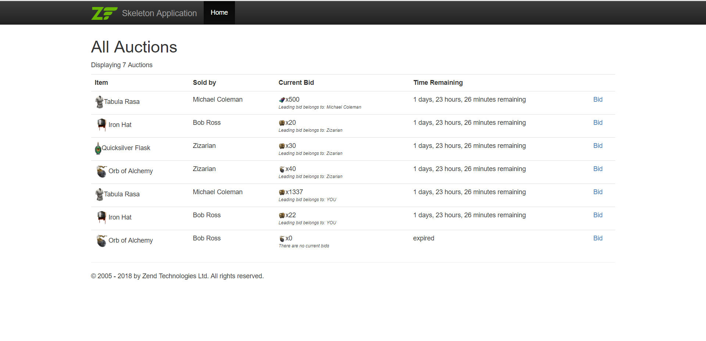

### ABOUT: 
This application is a simple Zend 3 PHP project to allow bidding on 'auctions'.

 - Two views: viewing auctions and creating bids 
 - Five tables: person, auction, currency, bid and item

### HOW TO RUN:
`git clone` the repository, `cd` into the directory and run `vagrant up`
visit http://localhost:8080

### TODO:
 1. Create PHPUnit tests 
 2. Add validator to only accept bids higher than  
    the current value.
 3. Disable bidding on auctions you own / are expired
